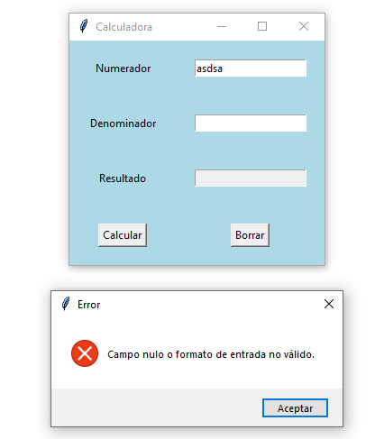
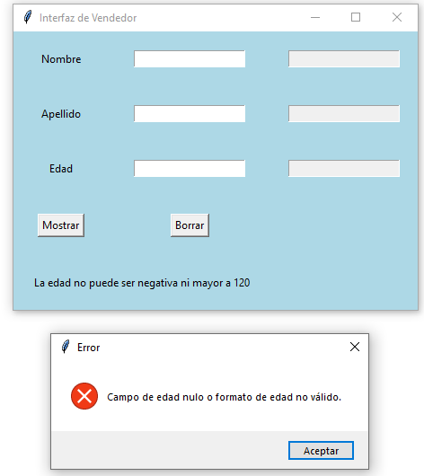
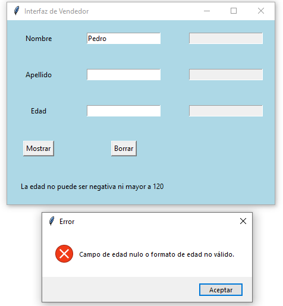
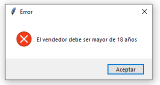
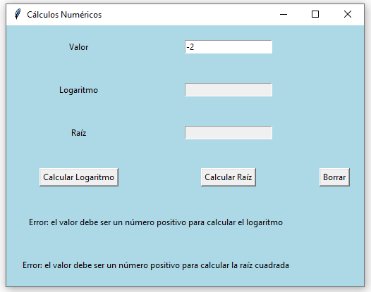

## Ejercicio 6.4 Excepciones (p. 399)

Las excepciones son un mecanismo especial para gestionar errores y permiten separar el tratamiento de errores del código normal de un programa (Kölling y Barnes, 2013).
El formato para escribir un bloque en el que se gestionan excepciones es:

```java
try {
    instrucciones
} catch {
    instrucciones
} finally {
    instrucciones
}
```

Dentro del bloque try se coloca el código que podría generar una excepción. Los bloques catch capturan y tratan una excepción cuando esta ocurre. Pueden existir varios bloques catch. Estos se definen directamente después del bloque try. Ningún código puede estar entre el final del bloque try y el comienzo del primer bloque catch. Los catch se evalúan por orden, si un catch atrapa la excepción que ha ocurrido, se ejecuta y los demás no.
Por último, el bloque finallly es opcional e incluye código que se ejecuta siempre, independientemente si se ha producido una excepción o no (Altadill-Izurra y Pérez-Martínez, 2017).

### Objetivos de aprendizaje
Al finalizar este ejercicio, el lector tendrá la capacidad para:

- Identificar bloques de código donde se pueden generar excepciones.
- Identificar los bloques catch que capturan una excepción específica.
- Reconocer y diferenciar los propósitos de los bloques try, catch y finally para la gestión de excepciones.

### Diagrama de Casos de uso


### Diagrama de Clases


### Solución

[Click para ver código fuente](https://github.com/Kolozuz/oop_unal_202501_act5/blob/main/Ejercicio1/code.py)

#### Ejecución del programa

**Sin ingresar un valor**


**Ingresando solamente un valor no válido**


**Ingresando solamente un valor válido/numérico**


**Ingresando 0 como denominador**


**Ingresando valores válidos**


## Ejercicio 6.5. Lanzamiento de excepciones (p. 404)

### Objetivos de aprendizaje
Al finalizar este ejercicio, el lector tendrá la capacidad para:

- Lanzar excepciones específicas en métodos de una clase.
- Conocer y aplicar la sentencia throw para el lanzamiento de excepciones.

### Enunciado: clase Vendedor
Se requiere implementar una clase vendedor que posee los siguientes atributos: nombre (tipo String), apellidos (tipo String) y edad (tipo int).
La clase contiene un constructor que inicialice los atributos de la clase. Además, la clase posee los siguientes métodos:

- Imprimir: muestra por pantalla los valores de sus atributos.
- Verificar edad: este método recibe como parámetro un valor entero que representa la edad del vendedor. Para que un vendedor
pueda desempeñar sus labores se requiere que sea mayor de edad
(mayor de 18 años). Si esta condición no se cumple, se lanza una
excepción de tipo IllegalArgumentException con el mensaje "El vendedor debe ser mayor de 18 años". Además, se evalúa si la edad se encuentra en el rango de 0 a 120, si no se cumple, se genera
una excepción de tipo IllegalArgumentException con el mensaje "La
edad no puede ser negativa ni mayor a 120". Si la edad cumple
estos requerimientos se pueden instanciar el objeto vendedor.

Además, se requiere que los datos del vendedor se ingresen por teclado.

### Diagrama de Casos de uso


### Diagrama de Clases


### Solución

[Click para ver código fuente](https://github.com/Kolozuz/oop_unal_202501_act5/blob/main/Ejercicio2/code.py)

#### Ejecución del programa

**Sin ingresar ningún valor**




**Ingresando solamente un valor**




**Ingresando un número negativo**


**Ingresando un número menor a 18 y mayor o igual a 0**




**Ingresando un número mayor a 120**


**Ingresando un valor no válido**


**Ingresando un valor válido**


## Ejercicio 6.6. `Catchs` múltiples (p. 410)

### Objetivos de aprendizaje
Al finalizar este ejercicio, el lector tendrá la capacidad para:

- Definir múltiples catch para el tratamiento de excepciones.
- Definir gestores para el tratamiento de excepciones aritméticas.

### Enunciado: clase CálculosNuméricos
Se requiere definir una clase denominada CálculosNúmericos que realice las siguientes operaciones:

- Calcular el logaritmo neperiano recibiendo un valor double como parámetro. Este método debe ser estático. Si el valor no es positivo
se genera una excepción aritmética.
- Calcular la raíz cuadrada recibiendo un valor double como parámetro. Este método debe ser estático. Si el valor no es positivo se genera una excepción aritmética.
Se debe crear un método main que utilice dichos métodos ingresando
un valor por teclado.

### Diagrama de Casos de uso


### Diagrama de Clases


### Solución

[Click para ver código fuente](https://github.com/Kolozuz/oop_unal_202501_act5/blob/main/Ejercicio3/code.py)

#### Ejecución del programa

**Sin ingresar un valor**


**Ingresando un valor negativo**



**Ingresando 0 como valor**


**Ingresando un valor no válido**


**Ingresando un valor válido**


## Ejercicio 6.7. Validación de campos (p. 417)

Las excepciones se pueden utilizar para validar el formato de campos de entrada. Por ejemplo:
- Restringir que un campo de entrada de datos sea numérico, alfabético, alfanumérico, etc.
- Restringir la cantidad de caracteres que debe tener un campo de entrada de datos.
- Impedir que se ingresen fechas anteriores a la fecha actual.
- Definir campos obligatorios en un formulario de tal manera que no reciba valores vacíos.
- Definir restricciones especiales de los campos de entrada. Por ejemplo, si es un correo electrónico, que tenga el carácter @.

Para estos casos, si se presentan situaciones que no cumplen dichas condiciones se debe generar la excepción correspondiente.

### Objetivo de aprendizaje

Al finalizar este ejercicio, el lector tendrá la capacidad para definir métodos que realicen validación de campos y generen las excepciones apropiadas en caso de que no se cumplan las condiciones estipuladas en los requisitos de un programa.

### Enunciado: clase EquipoMaratónProgramación

Un equipo de programadores desea participar en una maratón de programación. El equipo tiene los siguientes atributos:
- Nombre del equipo (tipo String).
- Universidad que está representando el equipo (tipo String).
- Lenguaje de programación que va a utilizar el equipo en la competencia (tipo String).
- Tamaño del equipo (tipo int).

Se requiere un constructor que inicialice los atributos del equipo. El equipo está conformado por varios programadores, mínimo dos y máximo tres. Cada programador posee nombre y apellidos (de tipo String). Se requieren además los siguientes métodos:
- Un método para determinar si el equipo está completo.
- Un método para añadir programadores al equipo. Si el equipo está lleno se debe imprimir la excepción correspondiente.
- Un método para validar los atributos nombre y apellidos de un programador para que reciban datos que sean solo texto. Si se reciben datos numéricos se debe generar la excepción correspondiente. Además, no se permiten que los campos String tengan una longitud igual o superior a 20 caracteres.
- En un método main se debe crear un equipo solicitando sus datos por teclado y se validan los nombres y apellidos de los programadores.

### Diagrama de Casos de uso


### Diagrama de Clases


### Solución

[Click para ver código fuente](https://github.com/Kolozuz/oop_unal_202501_act5/blob/main/Ejercicio4/code.py)

#### Ejecución del programa

**Cuando no se llena la información del equipo**


**Cuando se deja vacío alguno de los campos de los integrantes**


**Cuando alguno de los campos de los integrantes contiene dígitos**


**Cuando alguno de los campos de los integrantes tiene mas de 19 caracteres**


**Cuando la ejecucion es correcta**


## Ejercicio 6.8. Lectura de archivos (p. 425)

Al finalizar este ejercicio, el lector tendrá la capacidad para:

- Crear un flujo de bytes para leer archivos de texto.
- Conocer y aplicar las clases InputStreamReader y BufferedReader para la creación del flujo de bytes que facilita la lectura de archivos.

### Enunciado: clase LeerArchivo
Se tiene un archivo de texto denominado prueba.txt en una cierta localización en un sistema de archivos. Se requiere desarrollar un programa que lea dicho archivo de texto utilizando un flujo de bytes que muestre los contenidos del archivo en pantalla.

### Diagrama de Casos de uso


### Diagrama de Clases


### Solución

[Click para ver código fuente](https://github.com/Kolozuz/oop_unal_202501_act5/blob/main/Ejercicio5/code.py)

#### Ejecución del programa

**Interfaz gráfica**


**Cuando el archivo de prueba está en la misma ubicación del trabajo con el código**


**Cuando el archivo de prueba NO está en la misma ubicación del trabajo con el código**

