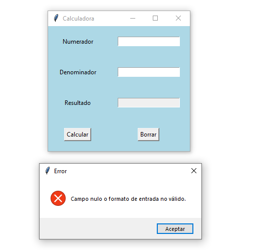
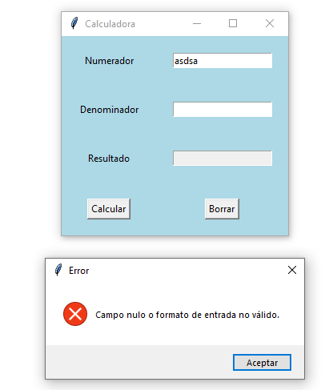
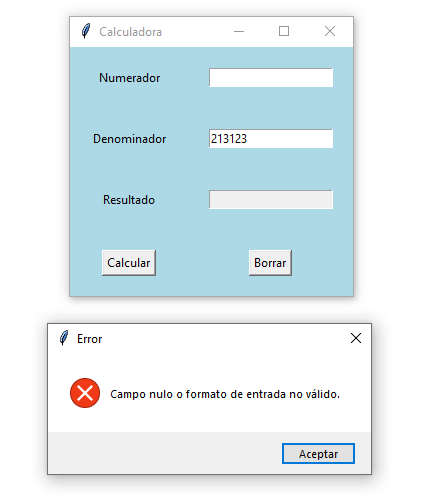
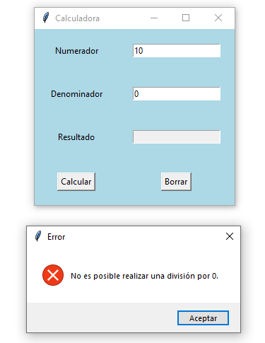
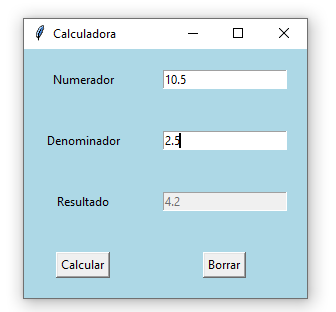

## Ejercicio 1

### Enunciado

### Diagrama de Casos de uso

### Diagrama de Clases

### Solución

[Click para ver código fuente](https://github.com/Kolozuz/oop_unal_202501_act5/blob/main/Ejercicio1/code.py)

#### Ejecución del programa

**Sin ingresar un valor**

**Ingresando solamente un valor no válido**

**Ingresando solamente un valor válido/numérico**

**Ingresando 0 como denominador**

**Ingresando valores válidos**

