## Ejercicio 6.5. Lanzamiento de excepciones (p. 404)

### Objetivos de aprendizaje
Al finalizar este ejercicio, el lector tendrá la capacidad para:

- Lanzar excepciones específicas en métodos de una clase.
- Conocer y aplicar la sentencia throw para el lanzamiento de excepciones.

### Enunciado: clase Vendedor
Se requiere implementar una clase vendedor que posee los siguientes atributos: nombre (tipo String), apellidos (tipo String) y edad (tipo int).
La clase contiene un constructor que inicialice los atributos de la clase. Además, la clase posee los siguientes métodos:

- Imprimir: muestra por pantalla los valores de sus atributos.
- Verificar edad: este método recibe como parámetro un valor entero que representa la edad del vendedor. Para que un vendedor
pueda desempeñar sus labores se requiere que sea mayor de edad
(mayor de 18 años). Si esta condición no se cumple, se lanza una
excepción de tipo IllegalArgumentException con el mensaje "El vendedor debe ser mayor de 18 años". Además, se evalúa si la edad se encuentra en el rango de 0 a 120, si no se cumple, se genera
una excepción de tipo IllegalArgumentException con el mensaje "La
edad no puede ser negativa ni mayor a 120". Si la edad cumple
estos requerimientos se pueden instanciar el objeto vendedor.

Además, se requiere que los datos del vendedor se ingresen por teclado.

### Diagrama de Casos de uso

### Diagrama de Clases

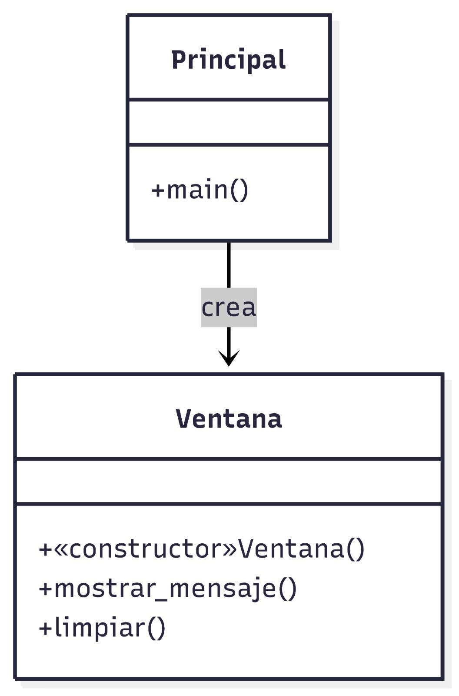

### Solución

[Click para ver código fuente](https://github.com/Kolozuz/oop_unal_202501_act5/blob/main/Ejercicio2/code.py)

#### Ejecución del programa

**Sin ingresar ningún valor**

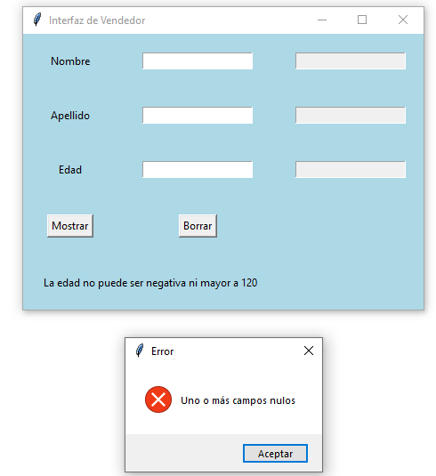

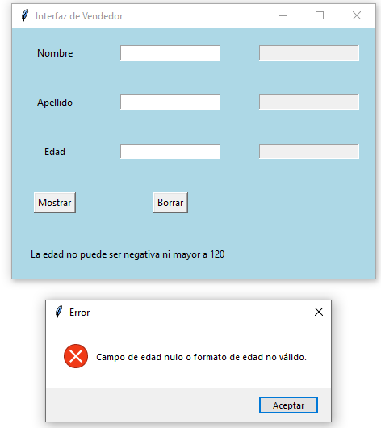

**Ingresando solamente un valor**

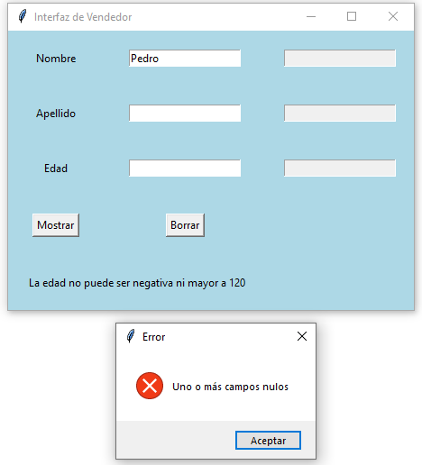

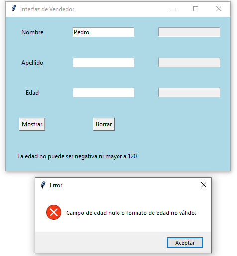

**Ingresando un número negativo**
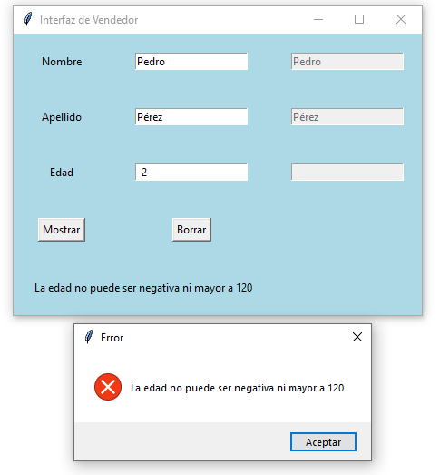

**Ingresando un número menor a 18 y mayor o igual a 0**

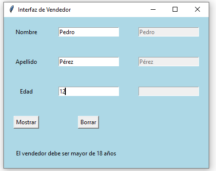

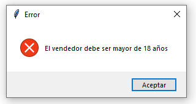

**Ingresando un número mayor a 120**

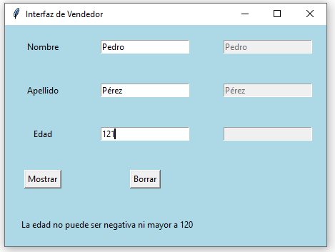

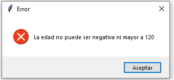

**Ingresando un valor no válido**

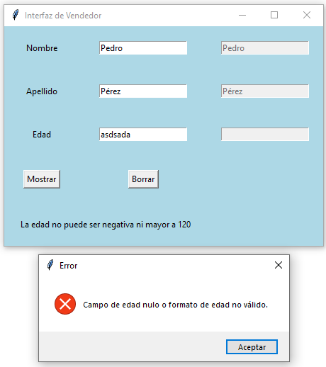

**Ingresando un valor válido**

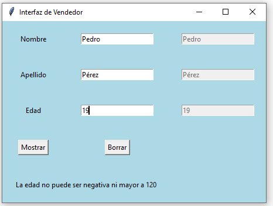