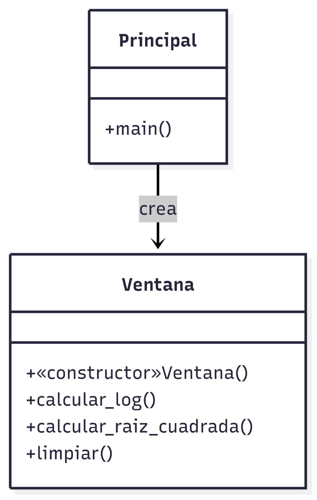
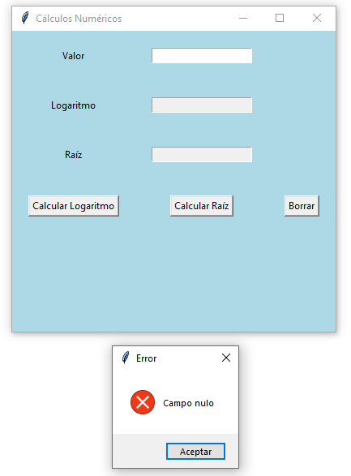
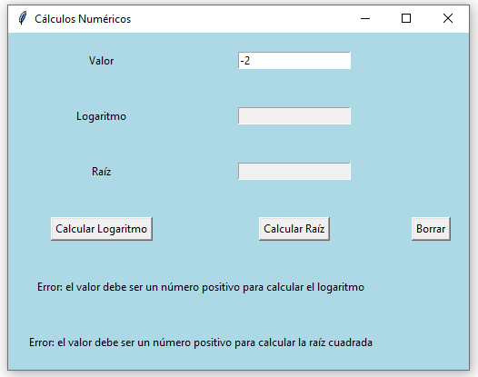
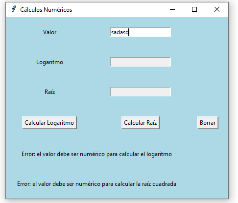
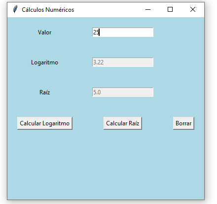

## Ejercicio 6.6. `Catchs` múltiples (p. 410)

### Objetivos de aprendizaje
Al finalizar este ejercicio, el lector tendrá la capacidad para:

- Definir múltiples catch para el tratamiento de excepciones.
- Definir gestores para el tratamiento de excepciones aritméticas.

### Enunciado: clase CálculosNuméricos
Se requiere definir una clase denominada CálculosNúmericos que realice las siguientes operaciones:

- Calcular el logaritmo neperiano recibiendo un valor double como parámetro. Este método debe ser estático. Si el valor no es positivo
se genera una excepción aritmética.
- Calcular la raíz cuadrada recibiendo un valor double como parámetro. Este método debe ser estático. Si el valor no es positivo se genera una excepción aritmética.
Se debe crear un método main que utilice dichos métodos ingresando
un valor por teclado.

### Diagrama de Casos de uso

### Diagrama de Clases

### Solución

[Click para ver código fuente](https://github.com/Kolozuz/oop_unal_202501_act5/blob/main/Ejercicio3/code.py)

#### Ejecución del programa

**Sin ingresar un valor**

**Ingresando un valor negativo**

**Ingresando 0 como valor**

**Ingresando un valor no válido**

**Ingresando un valor válido**

