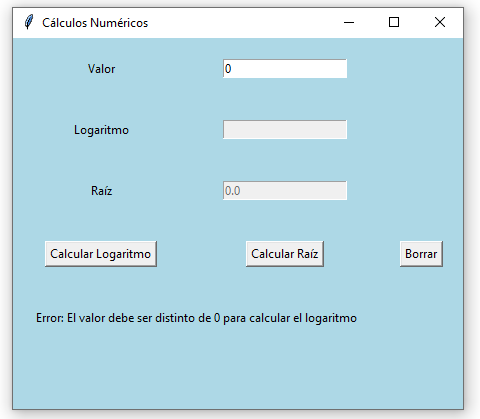

## Ejercicio 3

### Enunciado

### Diagrama de Casos de uso

### Diagrama de Clases

### Solución

[Click para ver código fuente](https://github.com/Kolozuz/oop_unal_202501_act5/blob/main/Ejercicio3/code.py)

#### Ejecución del programa

**Sin ingresar un valor**

**Ingresando un valor negativo**

**Ingresando 0 como valor**

**Ingresando un valor no válido**

**Ingresando un valor válido**

