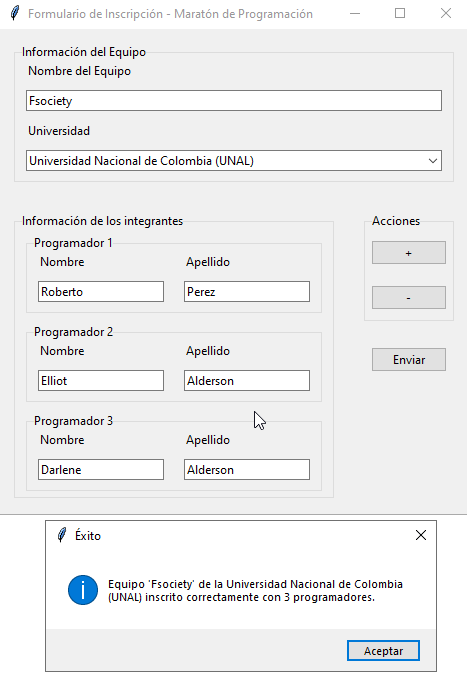

## Ejercicio 6.7. Validación de campos (p. 417)

Las excepciones se pueden utilizar para validar el formato de campos de entrada. Por ejemplo:
- Restringir que un campo de entrada de datos sea numérico, alfabético, alfanumérico, etc.
- Restringir la cantidad de caracteres que debe tener un campo de entrada de datos.
- Impedir que se ingresen fechas anteriores a la fecha actual.
- Definir campos obligatorios en un formulario de tal manera que no reciba valores vacíos.
- Definir restricciones especiales de los campos de entrada. Por ejemplo, si es un correo electrónico, que tenga el carácter @.

Para estos casos, si se presentan situaciones que no cumplen dichas condiciones se debe generar la excepción correspondiente.

### Objetivo de aprendizaje

Al finalizar este ejercicio, el lector tendrá la capacidad para definir métodos que realicen validación de campos y generen las excepciones apropiadas en caso de que no se cumplan las condiciones estipuladas en los requisitos de un programa.

### Enunciado: clase EquipoMaratónProgramación

Un equipo de programadores desea participar en una maratón de programación. El equipo tiene los siguientes atributos:
- Nombre del equipo (tipo String).
- Universidad que está representando el equipo (tipo String).
- Lenguaje de programación que va a utilizar el equipo en la competencia (tipo String).
- Tamaño del equipo (tipo int).

Se requiere un constructor que inicialice los atributos del equipo. El equipo está conformado por varios programadores, mínimo dos y máximo tres. Cada programador posee nombre y apellidos (de tipo String). Se requieren además los siguientes métodos:
- Un método para determinar si el equipo está completo.
- Un método para añadir programadores al equipo. Si el equipo está lleno se debe imprimir la excepción correspondiente.
- Un método para validar los atributos nombre y apellidos de un programador para que reciban datos que sean solo texto. Si se reciben datos numéricos se debe generar la excepción correspondiente. Además, no se permiten que los campos String tengan una longitud igual o superior a 20 caracteres.
- En un método main se debe crear un equipo solicitando sus datos por teclado y se validan los nombres y apellidos de los programadores.

### Diagrama de Casos de uso

### Diagrama de Clases

### Solución

[Click para ver código fuente](https://github.com/Kolozuz/oop_unal_202501_act5/blob/main/Ejercicio4/code.py)

#### Ejecución del programa

**Cuando no se llena la información del equipo**

**Cuando se deja vacío alguno de los campos de los integrantes**

**Cuando alguno de los campos de los integrantes contiene dígitos**

**Cuando alguno de los campos de los integrantes tiene mas de 19 caracteres**

**Cuando la ejecucion es correcta**

