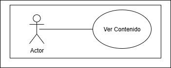
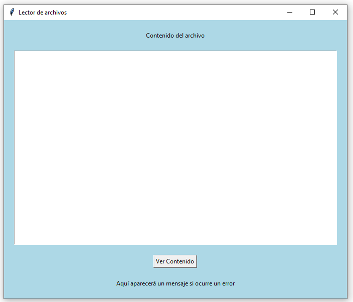
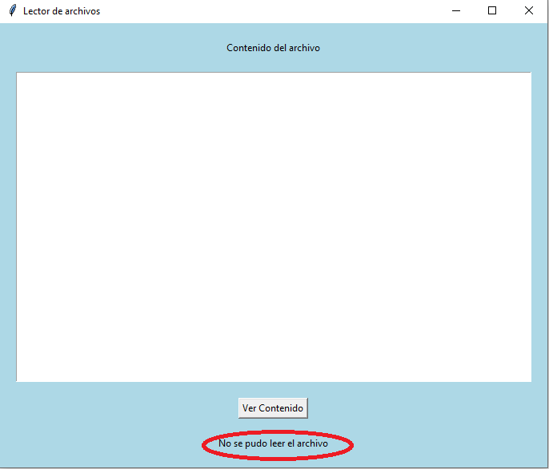

## Ejercicio 6.8. Lectura de archivos (p. 425)

Al finalizar este ejercicio, el lector tendrá la capacidad para:

- Crear un flujo de bytes para leer archivos de texto.
- Conocer y aplicar las clases InputStreamReader y BufferedReader para la creación del flujo de bytes que facilita la lectura de archivos.

### Enunciado: clase LeerArchivo
Se tiene un archivo de texto denominado prueba.txt en una cierta localización en un sistema de archivos. Se requiere desarrollar un programa que lea dicho archivo de texto utilizando un flujo de bytes que muestre los contenidos del archivo en pantalla.

### Diagrama de Casos de uso

### Diagrama de Clases

### Solución

[Click para ver código fuente](https://github.com/Kolozuz/oop_unal_202501_act5/blob/main/Ejercicio5/code.py)

#### Ejecución del programa

**Interfaz gráfica**

**Cuando el archivo de prueba está en la misma ubicación del trabajo con el código**

**Cuando el archivo de prueba NO está en la misma ubicación del trabajo con el código**

