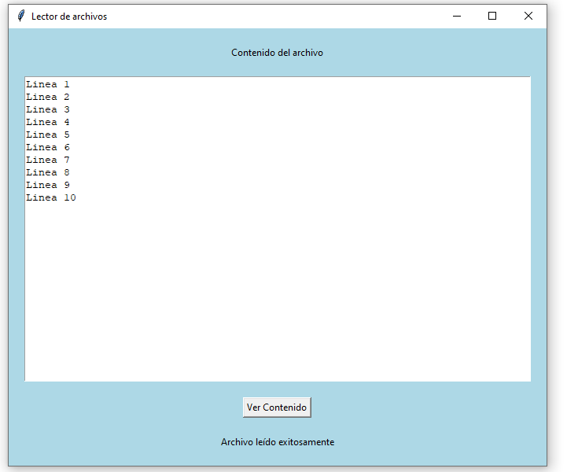

## Ejercicio 3

### Enunciado

### Diagrama de Casos de uso

### Diagrama de Clases

### Solución

[Click para ver código fuente](https://github.com/Kolozuz/oop_unal_202501_act5/blob/main/Ejercicio5/code.py)

#### Ejecución del programa

**Interfaz gráfica**

**Cuando el archivo de prueba está en la misma ubicación del trabajo con el código**

**Cuando el archivo de prueba NO está en la misma ubicación del trabajo con el código**

